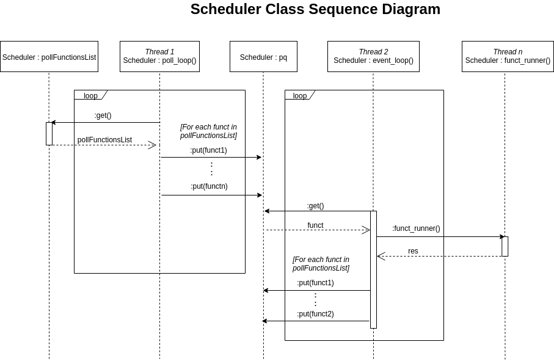
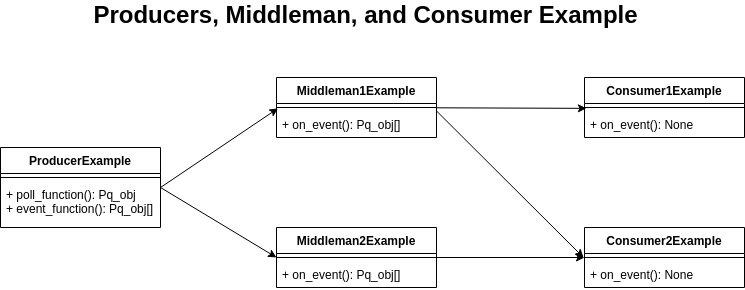
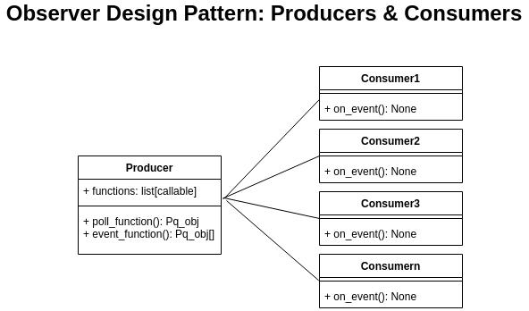

# Scheduler

The Scheduler will schedule tasks, such as sending/receiving video data, Rover movement controls, and sensor data between the Base Station and the Rover. Some tasks may have a higher priority over other tasks and may run more often.

# Explanation

The Scheduler is a mechanism that allows us to place a sequence of tasks into a queue, and executes each task in an ordered fashion, streamlining communication between different parts of an application. For example, instead of a class having to directly reference multiple other classes and pass data to them, it does not have to worry about that, and is only concerned with providing the function to be called when it is passed to the scheduler. 

`Scheduler` is driven by 2 main threads. When a `Scheduler` instance is instantiated, a list of functions, `pollFunctionsList` is stored. The meaning of a "polling" function is essentially a function that is called on a regular interval, and which may check the value of a variable or perform some action at that specific interval. In this case, a function, `poll_loop()`, "polls" each function in `pollFunctionsList`. 

The essence of the class is that each function in `pollFunctionsList` "produces" data (perhaps a number or a list with useful information) that will be "consumed" (i.e used one way or another) by a consumer, likely another class somewhere in the application. 

Then, when `Scheduler.run()` is called on the scheduler instance,this creates and starts the 2 main threads. The 2 threads are created with the following lines:

```python
	t = threading.Thread(target=self.poll_loop)
	t.start()
	t = threading.Thread(target=self.event_loop)
	t.start()
```

The `Scheduler` class in scheduler.py is executed and interacted with the help of those 2 main threads. This is illustrated in the following sequence diagram.



It is helpful to imagine that those two threads both control the flow of execution of the class, using only `poll_loop()` and `event_loop()`. By sharing resources and interacting with the task priority queue (`pq`), they fulfill the purpose of the scheduler.

To explain the behavior of the class, we must known what each thread does:
- **Thread 1**: Used as an "input" to the scheduler. It calls the function defined by the producer, and places the list of functions to be called (all of them located in "consumer" classes) into the priority queue. **Note**: Each function is wrapped around a `Pq_obj` (priority queue object), which becomes what we call a "task".
- **Thread 2**: Priority queue execution; the thread pulls tasks from the queue and creates a new thread for the task to run in. By the nature of the priority queue, when the thread pulls tasks from the queue, it gets given the ones with the highest priority first.
- **Thread 3-X**: Each thread is associated with a task, which when the wrapped function completes, the thread completes. Each thread can be considered the "output" of the scheduler when the task completes.


It is helpful to begin understanding the behavior of `Scheduler` by following _Thread 1_. At a defined interval, the thread will fetch all the functions in `self.pollFunctionsList` (a.k.a `self.pollFunctionsList` in the class), and push each function , `Pq_obj` instances onto `self.pq`, which is the queue of tasks that need to be executed. This process is repeated at a regular interval defined by `self.minPollTime`.

On the other hand, _Thread 2_ handles the actual execution of each task that has been pushed in `self.pq`, as it continuously fetches any functions that are in `pq`. After fetching a function from it, it starts a thread for **each** function. However, if the number of threads exceeds the maximum number defined in `self.maxThreads`, then the thread will keep checking until there are a small enough number of active threads to start a new thread.



# Usage

## Example 1: A simple Producer and Consumer

*This is a hypothetical example, not our actual implementation.*

Let's say the you have a class called `CommandReader`, that contains an attribute called `currentCommand`, whose value can be either `UP`,`DOWN`,`LEFT`,`RIGHT`. Your task is to pass that information to a class called `RobotArmManager`, that will command the arm to move one of those 4 directions. 

We can design a mechanism using the scheduler by writing the following code that makes `CommandReader` a "producer", and `RobotArmManager` a "consumer" in the context of the scheduler:

```python

class CommandReader():
	self.currentCommand = "UP"
	self.functs = []

	def poll_function(self):
		return [Pq_obj(3, self.event_function)]

	def event_function(self):
		todo = []
		for f in self.functs:
			todo.append(Pq_obj(3, f, self.currentCommand))

		return todo

	def add_function_to_call(self, function):
		self.functs.append(function)

class RobotArmManager():
	def on_event(self, command):
		print("The command received is ", command)

pollFunctions = []

producer = CommandReader()
pollFunctions.append(producer.poll_function)

consumer = RobotArmManager()
producer.add_function_to_call(consumer.on_event)

```

You will notice that when we create the instance of the producer and consumer, we "connect" the communication between the two classes with `producer.add_function_to_call(consumer.on_event)`, since `consumer.on_event` expects a `command` argument, and `producer.event_function` creates a task to call that function with the value `currentCommand`. 

In practice, it is possible to add as many functions to be called with `currentCommand` as needed. 

# Architectural Notes

The usage of the scheduler involves implemented an **Observer** design pattern, where the subject, a.k.a. the producer, maintains a list of its dependents, a.k.a. the consumers.

This architecture allows us to notify the dependents (a.k.a. observers) of the specified event. In this case, we notify the observers with data being passed as part of a `Pq_obj` task.

Below is a diagram representing that pattern:



# Reasons for Development

The Scheduler is the new central software that replaced ROS, which had a steep learning curve, was incompatible with Windows, and did not teach transferable skills to new recruits.

The new scheme will be written in Python and C++ with the Scheduler as the central Python threading mechanism.

Rather than having ROS subscribers and publishers, methods will be called when data comes, which put tasks into the priority queue. `Scheduler` will run everything and is replacing `roscore`.
